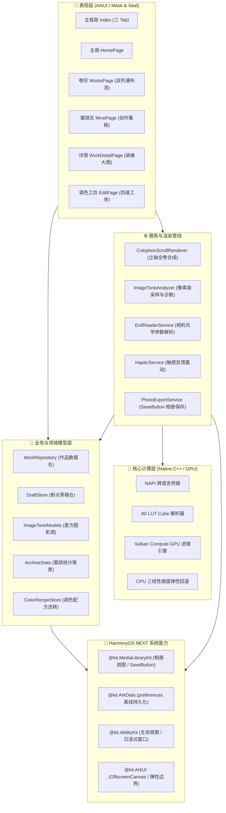

<div align="center">

# 微霏 · Vivid

**「山河入卷 · 文书钤印」—— 专为 HarmonyOS NEXT 打造的东方美学图像调色与长卷装裱工坊**

*An Oriental Aesthetic Image Color Grading & Colophon Mounting Studio on HarmonyOS NEXT.*

[](https://developer.huawei.com/consumer/cn/)
[](https://developer.huawei.com/)
[](https://www.vulkan.org/)
[](#-设计哲学--mask--seal-风格规范)
[](#-端侧隐私与安全规范)
[](#-自动化测试与工程质量保证)
[](LICENSE)

[功能特性](#-核心特性亮点) • [设计哲学](#-设计哲学--mask--seal-风格规范) • [系统架构](#-系统架构) • [工程目录](#-工程目录导览) • [快速上手](#-快速上手与工程构建) • [测试套件](#-自动化测试与工程质量保证)

</div>

---

## 📖 简介

**微霏（Vivid）** 是一款运行在华为 **HarmonyOS NEXT** 上的专业级摄影调色与东方装裱应用。

我们将现代数码摄影的“选片、调色、滤镜、装裱、归档”流程，与古代书画鉴藏中的**文书呈报、御批复核、天头题签、金石钤印、题跋长卷**深度融合，构建出独具东方雅韵的 **「炎国卷轴 · 文书钤印（Mask & Seal）」** 交互体验。

应用坚持**纯本地、全离线、端侧隐私优先**原则，无需联网、零商业广告追踪，所有的色彩运算、直方图诊断与海报装裱均在设备内部完成。

---

## ✨ 核心特性亮点

### 📜 1. 东方立轴【题跋长卷】装裱导出
- **立轴全卷合成**：采用离线 Canvas（`OffscreenCanvasRenderingContext2D`）高性能光栅化，将摄影画心、天头题签、干支纪年、EXIF 光学参数、中国传统五色谱带、案卷智能评注与文人朱砂大印一次性无缝熔铸为全景立轴海报。
- **中国传统五色谱带**：从画作中提取优势色，映射至中国传统国色（如远山黛、朱砂、素宣、玄天、缃叶），呈现极具收藏价值的东方画谱。
- **品第钤印鉴赏**：提供「神、逸、妙、阅、甲」五品文人朱砂方印，随心品鉴钤盖。

### 🎨 2. 专业胶片 3D LUT 与影调调节
- **双引擎硬件加速**：Native C++ 高性能解析 16³ 与 33³ `.cube` 文件，优先调度 **Vulkan Compute GPU** 加速渲染，并具备自适应 CPU 三线性插值保底。
- **全参数微调**：亮度（LUM）、对比度（CON）、饱和度（SAT）、色温（TMP）精密滑块控制，支持触感马达精准点火反馈（`HapticService`）与双击数值快速归零。
- **调色配方即时流转**：支持将当前作品的色彩配方与滤镜参数一键「复制配方」，并无缝跨卷复用。

### 🔍 3. 直方图明暗分析与 EXIF 智能题跋
- **光影明暗采样**：自研直方图分布采样算法，精准识别双峰大光比（`阴阳错落`）、高调空灵（`极目高明`）、低调幽微（`玄冥深致`）与温润中正。
- **官署校勘诊断**：当出现高光溢出、暗部死黑或灰蒙乏力时，自动出具「官署校勘便签」与调色修正建议。
- **光学全要素融合**：深度解析拍摄时间（早春初霁、暮秋晚晴）、镜头焦距、光圈、快门（毫秒规范化）与 ISO，自动撰写文质兼美的案卷批注。

### 🌊 4. 原始画幅无裁切与自适应瀑布流
- **原本比例无裁切**：彻底废除硬编码的固定容器裁切，图片画心按实际物理分辨率（`naturalRatio`）自适应舒展，彻底保全底栏相机水印、品牌 Logo 与黑白边框。
- **双列动态高度平衡瀑布流**：卷宗归档页采用基于预估高度的贪心平衡算法，横图、竖图、方图错落排布，视觉饱满从容。
- **沉浸式固定顶栏与悬浮操作区**：作品详情页支持顶部毛玻璃标题栏固定避让，底部悬浮常驻操作条，搭配「展卷详阅 · 案卷批注 ▾」丝滑引导，彻底告别假底困惑。

### 📊 5. 【卷宗案牍志】端侧创作数据看板
- **藏卷统揽**：实时汇总已封缄卷宗与研墨草稿总量，转译为传统大写汉字编号（如 `卷宗第肆零玖号`）。
- **主流气象与设色风骨**：动态聚类创作者最青睐的主导影调与冷暖色偏，并生成文人文案结语，记录专属创作轨迹。

### 🛡️ 6. 端侧隐私合规与 SaveButton 免弹窗导出
- **华为安全组件直出**：深度集成系统 `SaveButton` 资产安全控件，无需向用户索取相册全局读写权限，实现一键静默存入系统相册。
- **真本地私有沙箱**：基于 `preferences` 异步持久化，首次冷启动规范合规校验，同意后永久写盘绝不再弹，数据 100% 留存本机。

---

## 🏛️ 设计哲学 · Mask & Seal 风格规范

微霏的 UI/UX 全面遵循自研的 **Mask & Seal（炎国卷轴 · 文书钤印）** 东方文人设计系统：

```
文书隐喻：
  照片 / 作品  ──>  卷宗 (Archive)        调色预览比对  ──>  复核 (Audit)
  参数处理    ──>  呈报 (Submit)         保存存盘      ──>  封缄 / 落印 (Seal)
  服务凭证    ──>  印信 (Credential)     历史记录      ──>  档存 (Records)
```

### 设计令牌（Design Tokens）

| 令牌名 | 色值 / 尺寸 | 视觉隐喻与规范用途 |
|---|---|---|
| `PAPER_BASE` | `#DEDDD7` | **宣纸灰**：全局纸质底色，绘制 1px 极细朱砂网格 |
| `PAPER_SURFACE` | `#F2F1ED` | **浅纸白**：顶栏、浮层卡片、输入面板表面 |
| `PRIMARY` | `#7B171B` | **深朱砂主色**：重要按键、标题强调、聚焦状态 |
| `SEAL_RED` | `#B23B2F` | **金石钤印红**：文人印章、滑块游标、印信徽记 |
| `ON_SURFACE` | `#241918` | **正文墨色**：端庄文雅的墨汁正文字色 |
| `FONT_SERIF` | `Noto Serif SC` | **古风衬线**：标题一律使用衬线古风体，气韵肃穆 |
| `FONT_MONO` | `monospace` | **文书等宽**：卷宗编号、指标数字、等宽字距宽间距 |

---

## 🏗️ 系统架构

微霏采用分层松耦合、端侧响应式架构，严格遵循 ArkTS 强类型约束：



---

## 📂 工程目录导览

```text
Vivid/
├── entry/src/main/
│   ├── cpp/                         # Native 高性能计算核心
│   │   ├── filter/                  # 3D LUT 解析、Vulkan Compute 与 CPU 渲染器
│   │   └── napi/                    # ArkTS NAPI 桥接层与 PixelMap 内存映射
│   ├── ets/
│   │   ├── components/              # 模块化 UI 组件库
│   │   │   ├── common/              # Theme、PaperFrame、NotesCard、PageHeader
│   │   │   ├── editor/              # 调色面板、滤镜胶卷、边框与文字排印
│   │   │   ├── home/                # 首页看板、快捷工具法度、案头近辑
│   │   │   ├── mine/                # 【卷宗案牍志】创作看板
│   │   │   └── works/               # WorkCard (原本画幅)、WorkGrid (瀑布流)
│   │   ├── models/                  # 领域实体与状态管理器
│   │   │   ├── ArchiveStats.ets     # 本地数据看板聚合算法
│   │   │   ├── ColophonModels.ets   # 题跋长卷装裱契约
│   │   │   ├── ColorRecipe.ets      # 调色配方契约
│   │   │   ├── ImageToneModels.ets  # 直方图影调分类模型
│   │   │   ├── WorkRecord.ets       # 卷宗主模型 (尺寸、参数、影调、批注)
│   │   │   └── WorkRepository.ets   # 本地文件沙箱持久化仓库
│   │   ├── pages/                   # 独立路由页面
│   │   │   ├── Index.ets            # 三 Tab 沉浸式主入口与冷启动合规
│   │   │   ├── EditPage.ets         # 核心编辑调色大工作台
│   │   │   ├── WorkDetailPage.ets   # 卷宗详情长卷展阅
│   │   │   └── WorksPage.ets        # 全部卷宗归档页
│   │   ├── services/                # 业务核心服务
│   │   │   ├── ColophonScrollRenderer.ets # 题跋立轴全卷合成渲染器
│   │   │   ├── ColorRecipeStore.ets       # 配方复制/提取服务
│   │   │   ├── ExifReaderService.ets      # 相机参数提取清洗
│   │   │   ├── HapticService.ets          # 震动马达反馈服务
│   │   │   ├── ImageToneAnalyzer.ets      # 直方图影调采样诊断引擎
│   │   │   ├── PhotoExportService.ets     # SaveButton 授权相册导出
│   │   │   └── WorkSaveService.ets        # 卷宗存盘与快照生成
│   │   └── utils/                   # 工具类库
│   │       ├── PreferencesHelper.ets      # 首选项通用异步存盘
│   │       └── WorkImageUtils.ets         # 图像物理分辨率探测与 URI 规整
│   └── resources/                   # 设计资源、中文字体、国风色彩与矢量图标
└── tools/                           # 自动化测试套件与代码规范校验器
    ├── test-colophon-renderer.cjs   # 题跋全景立轴海报渲染校验
    ├── test-tone-analyzer.cjs       # 直方图算法与极端明暗诊断测试
    ├── test-recipe-store.cjs        # 调色配方存取与跨卷流转校验
    ├── test-work-resolution.cjs     # 真实画幅自适应与尺寸完整性校验
    ├── test-privacy-flow.cjs        # 首次冷启动首选项持久化刷盘校验
    └── verify-edge-effect.cjs       # 全局 20 处滑动边界回弹动效覆盖率校验
```

---

## 🛠️ 快速上手与工程构建

### 开发环境要求
- **IDE**：Huawei DevEco Studio 6.0+ 或 6.24+
- **SDK 版本**：HarmonyOS NEXT Developer Beta / Release (API 12+)
- **运行环境**：ARM64 纯鸿蒙设备或配套模拟器
- **Node.js**：v18+ (建议 v20+)

### 源码拉取与编译
```bash
# 1. 克隆代码仓库
git clone git@github.com:yzbmax/Vivid.git
cd Vivid

# 2. 安装依赖 (使用 ohpm)
ohpm install

# 3. 执行自动化规范与全量测试套件
for f in tools/test-*.cjs; do node "$f" || exit 1; done
node tools/verify-edge-effect.cjs
```

在 **DevEco Studio** 中直接打开工程目录，配置本地签名后即可点击 **Run** 部署至 HarmonyOS 设备。

---

## 🧪 自动化测试与工程质量保证

微霏采用严格的 **TDD（测试驱动开发）** 规范，建立覆盖纯逻辑、图形几何、数据持久化与动效规范的完备自动化测试矩阵。

在终端执行：
```bash
for f in tools/test-*.cjs; do node "$f" || exit 1; done && node tools/verify-edge-effect.cjs
```

### 测试套件覆盖范围：
1. `test-archive-stats.cjs`: 创作数据聚合、汉字大写转译与影调偏好聚类
2. `test-colophon-export-flow.cjs`: 题跋装裱弹窗全链路与临时副本生成
3. `test-colophon-renderer.cjs`: 离屏 Canvas 海报排印、五色谱带与朱砂钤印
4. `test-color-palette.cjs`: 传统色谱提取与欧氏色彩距离匹配
5. `test-compare-overlay.cjs`: 原图与调色实时对比蒙版几何运算
6. `test-editor-composition.cjs`: 编辑器多图层合成、边界限制与生命周期
7. `test-haptic-and-reset.cjs`: 触感马达集成与滑块双击复位校验
8. `test-privacy-flow.cjs`: 隐私协议首次冷启动探测与物理刷盘校验
9. `test-recipe-store.cjs`: 调色配方序列化与跨组件剪贴板流转
10. `test-save-flow.cjs`: SaveButton 免弹窗静默相册保存合规校验
11. `test-text-logic.cjs`: 文字图层字距、旋转、拖动钳制与代码点计算
12. `test-tone-analyzer.cjs`: 直方图采样、明暗双峰判定与官署校勘便签
13. `test-undo-redo.cjs`: 编辑器单步撤销 / 重做双向历史栈
14. `test-work-resolution.cjs`: 原始分辨率探测、无裁切画框与动态瀑布流
15. `verify-edge-effect.cjs`: 全局 20 处垂直/横向滚动容器弹性反馈动效覆盖率 100%

---

## 🤝 贡献规范

微霏遵循多人并行开发与代码审查规范：
- 严格遵循 ArkTS 强类型约束，禁止使用 `any` 或未定义的裸对象；
- ArkUI 图片加载一律遵循 `file://` 协议规整与兜底回退机制；
- 保持东方审美词表一致性，不得随意引入现代扁平或 Material 违和样式；
- 欢迎提交 PR 或 Issue 探讨更多东方美学滤镜与立轴装裱模板！

---

## 📄 开源许可证

本项目基于 [Apache License 2.0](LICENSE) 协议开源。
版权所有 © 2026 Vivid Team. All Rights Reserved.
